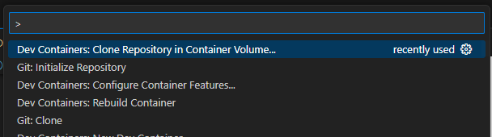

# Azure Private Resolver Prototype
**Terraform to build a prototype for the Azure Private Resolver**


The Azure Private Resolver is a feature in Azure DNS that allows you to resolve DNS names in a virtual network without the need to configure a custom DNS server. 

This prototype will use the Azure Private Resolver to:
- Resolve DNS names to on-premise resources from Azure 
- Resolve DNS names to an Azure resources from an on-premise network

We implemented the Azure Private Resolver to avoid using host name files to map the IP addresses to DNS names. Host files are difficult to maintain and do not scale.

## Prototype

The Terraform script will create 3 virtual networks

**On-premise network** - An Azure virtual network that simulates an on-premise network. Your real on-premise network would be connected to Azure through ExpressRoute or VPN. The virtual network has a:
  - **DNS Server** - A Windows Server 2019 DNS server. The DNS server will resolve DNS names for on-premise resources and forward DNS queries for Azure resources to the Azure Private Resolver Inbound subnet.
  - **VM** - An Ubuntu virtual machine for testing DNS name resolution.

**Hub network** - An Azure virtual network that is the Azure Hub in our Hub and Spoke architecture. This network has a:
- **Private Resolver** - An Azure Private Resolver that is used to resolve DNS queries across Azure and on-premise
- **Private Resolver Inbound subnet** - An Azure subnet that is used to forward DNS queries from the on-premise DNS server to the Azure Private Resolver.
- **Private Resolver Outbound subnet** - An Azure subnet that is used to forward DNS queries from the Azure to the on-premise DNS server.
- **Private Resolver endpoint rule-set** - An Azure Private Resolver endpoint rule-set is attached to a virtual network to forward DNS queries for on-premise resources to the Azure Private Resolver.
- **Private DNS Zone** - An Azure Private DNS Zone is attached to the Hub VNet to resolve DNS queries for Azure resources.
- **VM** - An Ubuntu virtual machine for testing DNS name resolution.
    
**Spoke network** - An Azure virtual network that represents an spoke in a Azure Hub and Spoke architecture. This network has a: 
  - **Storage account**- an Azure Storage account with a single table used to verify DNS name resolution works to Azure PaaS services.
  - **Private endpoint** - An Azure Private Endpoint is used to connect to the Azure Storage account.
  - **VM** - An Ubuntu virtual machine for testing DNS name resolution.


The on-premise and the spoke networks are both peered to the hub network. The hub and spoke virtual networks also have a DNS Forwarding ruleset attached to allow the on-premise DNS queries to be send to the on-premise DNS server. 

## Features

The Terraform script will create everything in the architecture diagram plus:
- Support for SSH to connect to each virtual machine. 
  - SSH keys are generated in the test folder
  - Scripts to SSH to each VM for manual testing
  - Script to automatically connect to each VM and run nslookup for resources in different virtual networks
- Support for RDP to connect to the Windows 2019 DNS server

## Installation and Usage

The easiest way to get started is to use the [Visual Studio Code Dev Container](https://code.visualstudio.com/docs/devcontainers/containers) that is in root of this Terraform repository.  The Dev Container will install all the tools you need to run the Terraform scripts and connect to Azure.


### Prerequisites to use the Dev Container
1. Install [Visual Studio Code](https://code.visualstudio.com/download)
2.  Install Docker for [Windows](https://docs.docker.com/docker-for-windows/install/) or [Mac](https://docs.docker.com/docker-for-mac/install/) 
3. Install the [Dev Container Extension](https://marketplace.visualstudio.com/items?itemName=ms-vscode-remote.remote-containers) for Visual Studio Code

### Setup

1. Clone the repository into a Dev Container volume  
   1. Open the Visual Studio code command palette(Ctrl-Shift-P) 
   2. Type "Dev Containers: Clone Repository in Container volume" 

      
    
    3. Select GitHub as the remote source. 
    4. Type scottmillers/terraform to select my terraform repository. 
    5. Select the main branch. 
    6. Build the new container.

2. Open a bash terminal in Visual Studio Code 

3. Login to Azure using the Azure CLI
   ```
    $az login
    ```
4. Run the terraform script to build the prototype
   ```
    $cd azure/private-resolver-prototype
    $terraform init
    ...
    $terraform plan
    ...
    $terraform apply
  ``` 


 


